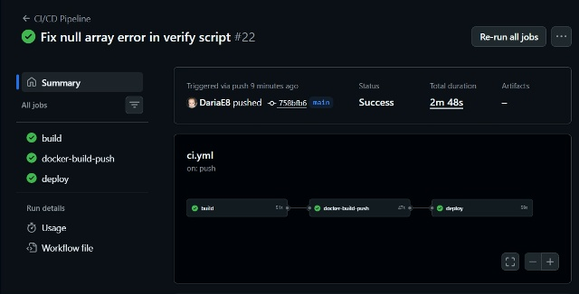
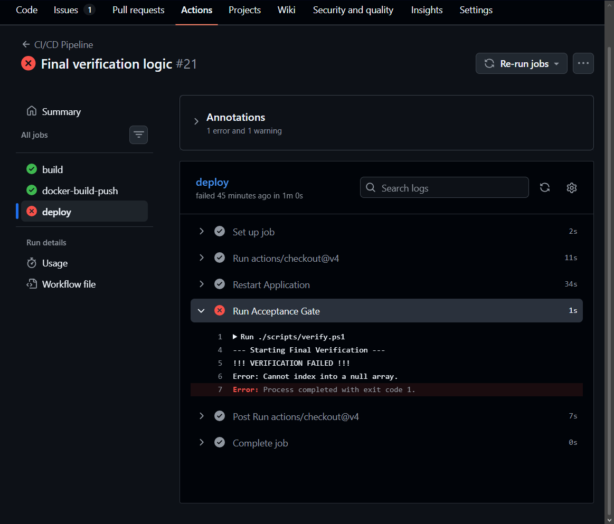
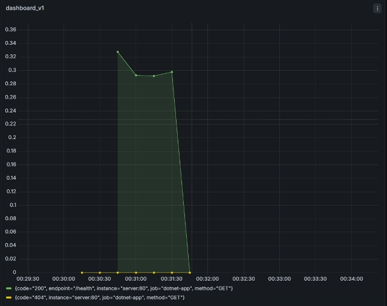
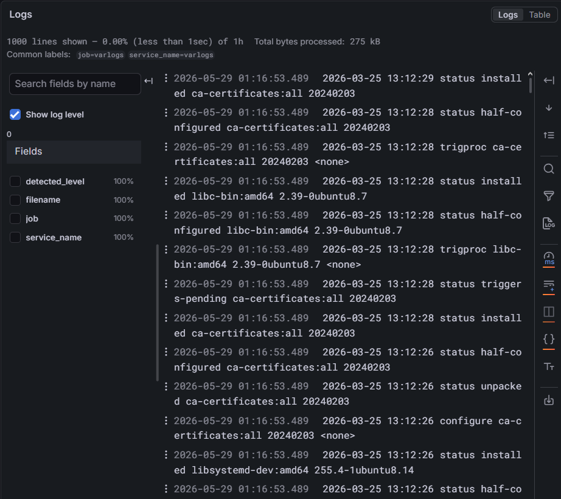

# Отчет по настройке CI/CD и системы мониторинга (Развертывание API)

В данном документе описана архитектура автоматизации развертывания проекта RpgGameAPI2, настройка сквозного CI/CD пайплайна с использованием GitHub Actions (Self-Hosted Runner), а также конфигурация системы мониторинга и логирования на базе Prometheus, Grafana и Loki.

---

## 1. Настройка CI/CD пайплайна

Автоматизация развертывания реализована в файле конфигурации `.github/workflows/ci.yml`. Пайплайн запускается автоматически при каждом пуше в основную ветку или при создании Pull Request и состоит из следующих последовательных этапов:

1. **Build & Test**: Сборка .NET проекта и запуск модульных тестов для проверки корректности нового кода.
2. **Docker Build & Push**: Сборка Docker-образа приложения и его отправка в Docker Hub. Образ тегируется как `latest`, а также уникальным хэшем коммита (`commit-sha`) для обеспечения прослеживаемости версий.
3. **Deploy**: Выполняется на локальном `self-hosted runner`. Пайплайн обновляет окружение с помощью `docker compose pull` и `docker compose up -d`, разворачивая новую версию приложения за балансировщиком нагрузки Nginx.
4. **Acceptance Gate**: Финальный этап верификации. Скрипт автоматического контроля опрашивает Prometheus API. Если API недоступно, возвращает ошибки или уровень ошибок (5xx) превышает установленный порог (5%), деплой маркируется как неудачный, сигнализируя о критической проблеме.

### Скриншоты этапов CI/CD:

* **Успешный прогон пайплайна (Все этапы пройдены успешно):**
  

* **Заблокированный деплой (Acceptance Gate завершился ошибкой):**
  

---

## 2. Архитектура системы мониторинга и логирования

Мониторинг развернут в изолированном контуре внутри Docker и состоит из следующих компонентов:
* **Nginx**: Выступает в качестве Reverse Proxy и балансировщика нагрузки, распределяющего входящие запросы на порту `80` между репликами сервиса `server`.
* **Prometheus**: Опрашивает эндпоинт приложения `/metrics` (метрика `http_requests_received_total`), собирая данные о количестве запросов, кодах ответов (200, 404, 500) и задержках (Latency).
* **Grafana**: Используется для визуализации собранных метрик. Создан кастомный дашборд для отслеживания RPS (Requests Per Second) и стабильности системы.
* **Loki & Promtail**: Promtail собирает логи контейнеров из Docker и перенаправляет их в Loki для централизованного хранения и анализа через интерфейс Grafana Explore.

### Скриншоты мониторинга под нагрузкой:

* **Grafana-дашборд с живыми метриками во время нагрузочного теста:**
  *(На графике отчетливо видны всплески успешных ответов (200 OK) и ошибок (404) в момент генерации параллельных запросов к API через Nginx).*
  

* **Grafana Explore с логами из Loki:**
  *(Доказательство успешного сбора и индексации логов контейнера. Видны структурированные записи входящих HTTP-запросов, например `GET /health`).*
  

---

## 3. Команды для проверки и генерации нагрузки

Для демонстрации работы системы и проверки метрик в реальном времени используются сценарии, зафиксированные в `docs/curl_examples.sh`.

1. **Проверка работоспособности API (Health Check):**
   ```bash
   curl -i http://localhost/health
   ```

Ожидаемый ответ: StatusCode: 200 OK, Content: Healthy

2. **Имитация пользовательской нагрузки**

Для демонстрации всплесков на графиках Grafana запускается цикл из 50 последовательных запросов:
   ```powershell
   for ($i = 1; $i -le 50; $i++) {
    Invoke-WebRequest -Uri "http://localhost/health" -Method Get -ErrorAction SilentlyContinue | Out-Null
    Write-Host "Request $i sent"
}
   ``` 


Вывод: Реализованная система полностью удовлетворяет требованиям отказоустойчивости CI/CD. Acceptance Gate гарантирует, что неисправная версия приложения (например, возвращающая 500-ю ошибку на эндпоинте /health) будет автоматически заблокирована на этапе деплоя, не нарушая работу production-окружения.